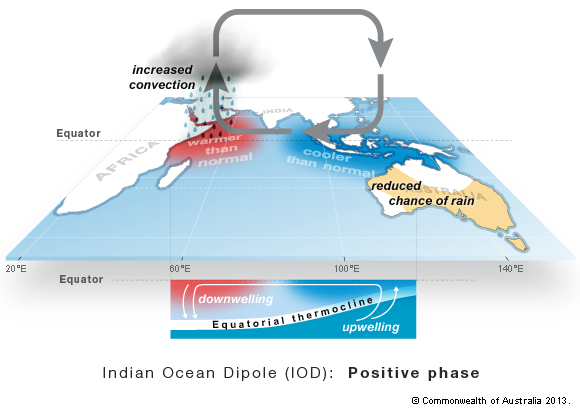

[This assignment is for ETC5521 Assignment 1 by Team `r rmarkdown::metadata$team` comprising of `r knitr::combine_words(rmarkdown::metadata$author)`.]{style="color:#006DAE;"}

```{r setup, include=FALSE}
knitr::opts_chunk$set(echo = FALSE, messages=FALSE, warning=FALSE, fig.pos = 'H', fig.align ='center')
```

```{r load-libraries, message=FALSE}
library(readr)
library(tidyverse)
library(here)
library(knitr)
library(lubridate)
library(ggplot2)
library(GGally)
library(dygraphs)
library(xts)
library(kableExtra)
library(leaflet)
library(hrbrthemes)
library(dplyr)
library(miceadds)
library(plotly)
library(ggrepel)
library(scales)

select <- dplyr::select
```


# Introduction and motivation

Bushfires that raged in Australia from September 2019 to early 2020 captured the attention of people worldwide, especially the out-of-control bushfires in Victoria and New South Wales(NSW). However, looking at the Australian bushfires' history data, we can find that Australia suffers from different degrees and quantities of bushfires every year. It is exciting to explore the link between Australian fire history and climate change. **What climatic conditions caused the frequent occurrence of the bushfires in Australia?**      
In this analysis, R is the main tool for data cleaning and analysis.  

The rest of the analysis proceeds as follows. Section \@ref(data) presents the data description. Section \@ref(analysis) details the findings in data analysis. The limitations of the analysis are presented in Section \@ref(limitation). Finally, Section \@ref(conclusion) provides the conclusions of this analysis.  
  
## Research questions

This analysis aims to explore three secondary questions:   
- When and where were the most widespread fires burning?   
- Was temperature to be blamed for bushfires in Australia?   
- Was rainfall to be blamed for bushfires in Australia?  

# Data description {#data}

This section mainly introduces the data, data sources and data description.   
There are three data sets used on this analysis, and the cleaned data is obtained from [GitHub tidytuesday](https://github.com/rfordatascience/tidytuesday/blob/master/data/2020/2020-01-07/readme.md).  

```{r read-data, warning=FALSE, message=FALSE}
# please find the data cleaning code in *data-cleaning code script.R*
# nasa_fire <- readr::read_csv(here::here("data/2020-01-07/fire_archive_M6_147063.csv")) %>% select(-instrument,-type)

#write to rds dataset to make it smaller
#save(nasa_fire, file = "nasa_fire.Rdata")
# load data .Rdata

nasa_fire <- load.Rdata2(filename = "nasa_fire.Rdata")

temperature <- read.csv(here::here("data/2020-01-07/temperature_new.csv"))
rainfall <- read.csv(here::here("data/2020-01-07/rainfall_new.csv"))
```

## Australia fire data

The `fire` data source is from [NASA](https://firms.modaps.eosdis.nasa.gov/download/)[@nasa] "Active Fires Dataset" via the MODIS fire product collection. MODIS active fire product is detected the fire data in every 5 minutes and collected through each tile with horizontal and vertical coordinate.The data contains the fire information of Australia with `r nrow(nasa_fire)` observations from 2000-11-01 to 2020-01-05.   

<!-- The variables information included in the data are as the following table, latitude, longitude and acq_date variables were mainly used for this analysis.     -->

```{r fire-data, warning=FALSE, message=FALSE}
fire_data <- data.frame(
  Variable = c("latitude", "longitude", "brightness", "scan", 
               "track", "acq_date", "act_time", "satellite", 
               "confidence", "version", "dbright_t31","frq", "day_night"),
  Description = c("Center of 1km fire pixel but not necessarily the actual location of the fire as one or more fires can be detected within the 1km pixel.", 
                  "Center of 1km fire pixel but not necessarily the actual location of the fire as one or more fires can be detected within the 1km pixel.", 
                  "Channel 21/22 brightness temperature of the fire pixel measured in Kelvin.", 
                  "The algorithm produces 1km fire pixels but MODIS pixels get bigger toward the edge of scan. Scan and track reflect actual pixel size.", 
                  "The algorithm produces 1km fire pixels but MODIS pixels get bigger toward the edge of scan. Scan and track reflect actual pixel size.",
                  "Date of MODIS acquisition.",
                  "Time of acquisition/overpass of the satellite (in UTC).",
                  "A = Aqua and T = Terra.",
                  "This value is based on a collection of intermediate algorithm quantities used in the detection process. It is intended to help users gauge the quality of individual hotspot/fire pixels. Confidence estimates range between 0 and 100% and are assigned one of the three fire classes (low-confidence fire, nominal-confidence fire, or high-confidence fire).",
                  "Version identifies the collection (e.g. MODIS Collection 6) and source of data processing: Near Real-Time (NRT suffix added to collection) or Standard Processing (collection only). '6.0NRT' - Collection 6 NRT processing.'6.0' - Collection 6 Standard processing. Find out more on collections and on the differences between FIRMS data sourced from LANCE FIRMS and University of Maryland.",
                  "Channel 31 brightness temperature of the fire pixel measured in Kelvin.", 
                  "Depicts the pixel-integrated fire radiative power in MW (megawatts).",
                  "D = Daytime, N = Nighttime"))

fire_data %>%
  kable(caption = "Australia fire data") %>%
  kable_styling(bootstrap_options = 
                c("striped", "condensed"), 
                full_width = F, 
                position = "center")
```


## Climate data

For climate data, temperature and rainfall was gathered from the Australian [Bureau of Meterology (BoM)](http://www.bom.gov.au/?ref=logo), of which is used the weather station to measure a variety of aspects of the weather.    
  
<!-- The `Rainfall` data was sourced from six major Australian cities: Perth, Adelaide, Melbourne, Sydney,Brisbane and Canberra, and the cleaned data is obtained from [GitHub tidytuesday](https://raw.githubusercontent.com/rfordatascience/tidytuesday/master/data/2020/2020-01-07/rainfall.csv), which is from 1858-01-01 to 2020-01-06, containing more than 230,000 observations.  -->
In order to maintain the complete information in six cities, we added some missing values for Brisbane and Canberra from the [source website](http://www.bom.gov.au/climate/data) and cleaned them to obtain the data from 1968-01-01 to 2017-12-31 in Canberra and from 1893-01-01 to 1998-12-31 in Brisbane. The new rainfall data is constructed by the old one and supplemental one and then become the final rainfall data set.   
  
The `temperature` data is divided into two parts, with the cleaned data obtained directly from [GitHub tidytuesday](https://raw.githubusercontent.com/rfordatascience/tidytuesday/master/data/2020/2020-01-07/temperature.csv), which is from 1910-01-01 to 2019-05-31. And we found the time range of the cleaned `temperature` data cannot match the `fire` data, in order to further analysis of the relationship between the fire and the temperature, we decided to download the new temperature data from the [source website](http://www.bom.gov.au/climate/data/index.shtml??zoom=1&lat=-26.9635&lon=133.4635&layers=B0000TFFFFFFFFFTFFFFFFFFFFFFFFFFTTT&dp=IDC10001&p_nccObsCode=201&p_display_type=dailyDataFile), and cleaned it to obtain the new data from 2019-06-01 to 2020-01-05. 
<!-- Finally, the new data were merge with the Github data to produce a final `temperature` data from 1910-01-01 to 2020-01-05, with more than 530,000 observations.     -->
  
Also, there are seven weather stations were chosen, based on seven Australian cities such as  Perth, Adelaide, Melbourne, Sydney, Brisbane, Port Lincoln and Canberra.   
  
The climate data structure is shown as the below tables. In this analysis, date, temperature and temp_type variables for `temperature` data set were mainly used, and year, city_name and rainfall variables for `rainfall` data set as well.   

```{r temp-data, warning=FALSE, message=FALSE}
temperature_data <- tibble(Variable = c("city_name", "date", "temperature", "temp_type", "site_name"),
                          Class = c( "character",  "double", "double","character", "character"),
                          Description = c("City Name", 
                                          "Date", 
                                          "Temperature in Celsius", 
                                          "Temperature type (min/max daily)", 
                                          "Actual site/weather station")) 
temperature_data %>%
  kable(caption = "Temperature data") %>%
  kable_styling(bootstrap_options = "striped", 
                full_width = F, 
                position = "center")
```

```{r rainfall-data, message=FALSE}
rainfall_data <- data.frame(Variable = c("station_code",
                              "city_name",
                              "year",
                              "month",
                              "day",
                              "rainfall",
                              "period",
                              "quality",
                              "lat",
                              "long",
                              "station_name"),
                          Class = c("character", "character", "double",
                                    "character","character", "double", 
                                    "double","character","double","double", "character"),
                          Description = c("Station Code",
                                          "City Name", 
                                          "year",
                                          "month",
                                          "day",
                                          "Trainfall in millimeters", 
                                          "how many days was it collected across",
                                          "	Certified quality or not",
                                          "latitude",
                                          "longitude",
                                          "Station Name")) 
rainfall_data%>%
  kable(caption = "Rainfall data") %>%
  kable_styling(bootstrap_options = "striped", 
                full_width = F, 
                position = "center")
```

# Limitations of analysis {#limitation}

This section mainly introduces two main limitations of this analysis:   
- There is no regional division in the fire data. We have indistinctly divided seven states or regions according to Australia's longitude and latitude, which may lead to bias in the analysis results for location.   
- The temperature and rainfall data include only some major cities, and comparing with the fire data, the sample is too small. Therefore,  the analysis of the link between fires and climate data in Section \@ref(analysis) is not accurate and will cause deviation in results.  

# Analysis and findings {#analysis}

## Climate Conditions

### Where does rainfall occur the most in Australia? 


### Where is the hottest climate in Australia?


## Bushfires

The Australian climate is generally hot and dry, bushfires can occur at anytime of the year for the most of regions[@bushfire]. However, are there more bushfires prefer happened in the summer or winter? 

<!-- Did bushfires more likely to occur in Northern Territory(NT)?  KEEP IT AT THE LAST FOR SURPRISE -->

In this section, we will discuss it by analyzing the bushfire data for the past 20 years. 

### In which months are bushfires burning? {#month}

```{r when,fig.cap="Yearly Australian fires from 2001 until 2020", warning=FALSE, message=FALSE}

m <- factor(c("Jan", "Feb", "Mar", "Apr", "May", "Jun", "Jul", "Aug", "Sep", "Oct", "Nov", "Dec"))

data_fire_Year <- nasa_fire %>% 
  mutate(acq_date = as.POSIXct(acq_date)) %>% 
  mutate(Year =year(acq_date),Month = month(acq_date)) %>% 
  mutate(Year = factor(Year)) %>% 
  mutate(Month = case_when(Month == "1" ~ "Jan",
                           Month == "2" ~ "Feb",
                           Month == "3" ~ "Mar",
                           Month == "4" ~ "Apr",
                           Month == "5" ~ "May",
                           Month == "6" ~ "Jun",
                           Month == "7" ~ "Jul",
                           Month == "8" ~ "Aug",
                           Month == "9" ~ "Sep",
                           Month == "10" ~ "Oct",
                           Month == "11" ~ "Nov",
                           Month == "12" ~ "Dec",
                                                     )) %>% 
  mutate(Month = factor(Month, levels = m)) %>% 
  group_by(Year,Month)%>% 
  summarise(Total = n()) 


# m <- factor(c("Jan", "Feb", "Mar", "Apr", "May", "Jun", "Jul", "Aug", "Sep", "Oct", "Nov", "Dec"), levels = c("Jan", "Feb", "Mar", "Apr", "May", "Jun", "Jul", "Aug", "Sep", "Oct", "Nov", "Dec"))

p1 <- data_fire_Year %>% 
  mutate( highlight=ifelse(Year=="2019", "2019", "Other")) %>% 
  ggplot( aes(x=Month, 
              y=Total, 
              group=Year, 
              color=highlight, 
              size=highlight)) +
  # scale_x_continuous(breaks = seq(1, 12, by = 1))+
  geom_line()+
  # geom_label( x=4.5, y=2000, 
  #             label="Other years,2001 to 2018", 
  #             size=2, 
  #             color="#69b3a2")+
  # geom_label( x=11.5, y=90000, 
  #             label="2019", 
  #             size=3, 
  #             color="#69b3a2")+
  # geom_label( x=8.5, 
  #             y=115000, 
  #             label="2011", 
  #             size=3, 
  #             color="#69b3a2")+
  scale_color_manual(values = c("red", "grey")) +
    scale_size_manual(values=c(1.5,0.2)) +
    theme(legend.position="none") +
    ggtitle("Yearly Australian fires from 2001 until 2020") +
    theme(axis.text.y = element_text(color = "grey", 
                                             face = "bold"),
        plot.title = element_text(face = "bold"),
        plot.background = element_rect(fill="white"),
        panel.background = element_rect(fill="white"))
 
ggplotly(p1) 
```

From Figure \@ref(fig:when), there are some unusual phenomena. 
Firstly, we can see that the bushfires trend line in 2019 is quite different from other years. 

>> When the trend in other years (i.e. 2011 and 2012) seems to reach a peak in August and October respectively, the trend of bushfire in 2019 is still growing until December 2019. Unfortunately, we do not have additional data to see the continuity of the 2019 trend line in 2020. 
<!-- the main reason for that is the occurrence of extensive bushfires in Australia for 2019.  -->

<!-- And the bushfires from September 2019 is the most massive bushfire since European settlement[@nolan2020causes].  -->

>> According to the figure, the most severe bushfire occurs in 2011 with the number of spots reach 120.348 fire spots. We will look further into 2011 in the figure below.

<!-- Moreover, there was a significant increase in the number of bushfires in September 2011, far more than in any other year in the same period.  -->

<!-- <!-- As @blanchi2014environmental states, the combination of low rainfalls and strong winds led to the outbreak of bushfires in 2011.   --> -->

```{r average-rain, fig.cap ="Average monthly rainfall from 2001", warning=FALSE, message=FALSE}
rain_agv <- rainfall %>% 
  filter(year == "2011") %>% 
  mutate(month = case_when(month == "1" ~ "Jan",
                           month == "2" ~ "Feb",
                           month == "3" ~ "Mar",
                           month == "4" ~ "Apr",
                           month == "5" ~ "May",
                           month == "6" ~ "Jun",
                           month == "7" ~ "Jul",
                           month == "8" ~ "Aug",
                           month == "9" ~ "Sep",
                           month == "10" ~ "Oct",
                           month == "11" ~ "Nov",
                           month == "12" ~ "Dec",
                                                     )) %>% 
  group_by (month, city_name) %>% 
  summarise(`Average rainfall`= mean(rainfall,na.rm=TRUE)) %>% 
  arrange(`Average rainfall`)
 
m <- factor(c("Jan", "Feb", "Mar", "Apr", "May", "Jun", "Jul", "Aug", "Sep", "Oct", "Nov", "Dec"))
 
r_agv <- rain_agv %>%
  mutate(month) %>%
  ggplot(aes(x= factor(month, m), y=`Average rainfall`/100) ) +
    # geom_segment(aes(x=month ,xend= month, y=0, yend=`Average rainfall`), color="grey") +
    geom_point(size=3, color="#69b3a2") +
    # theme_ipsum() +
    theme_bw()+
    scale_y_continuous(labels= scales::percent)+
    xlab("Month")+
  ylab("Average Rainfall")+
    ggtitle("Monthly Rainfall in 2011") +
    facet_wrap(~city_name, nrow = 3) 

ggplotly(r_agv)
```

As can be seen from figure \@ref(fig:average-rain), in 2011 (which is the worst year) 

Also, it's interesting to find that bushfires are more likely to occur in May, and month from August to November, especially October. However, August to October is the winter to spring period in Australia. It seems that the frequent occurrence of bushfires during this period mainly due to dryness, which makes forest fuels more likely to catch fire[@sullivan2012fuel]. Moreover, comparing with Figure \@ref(fig:average-rain), it can be easy to find that the driest months are September, October and May, which coincided with the peak of the bushfires.   

### Where are the bushfires burning?

In this part, we will focus on the relationship between bushfires and geographic locations. 
Firstly, we divided bushfire data into different states or regions according to the latitude and longitude, because the data downloaded from NASA does not contain information for states or regions. Since the borders of NSW and Victoria are not easily distinguished, so we finally putting them together as one region.  

```{r state,fig.cap=" The number of bushfire in different states or regions in the past 20 years", warning=FALSE, message=FALSE}
# divide regions
WA_fire <- nasa_fire %>% 
  filter(longitude < 128) %>% 
  mutate(Year = year(acq_date)) %>% 
  mutate(state = "WA")

NT_fire <- nasa_fire %>% 
  filter(longitude < 138, latitude < '-25')  %>% 
  filter(128<longitude) %>% 
  mutate(Year = year(acq_date)) %>% 
  mutate(state = "NT") 

SA_fire <- nasa_fire %>% 
  filter(longitude < 141, latitude > '-25')  %>% 
  filter(128<longitude) %>% 
  mutate(Year = year(acq_date)) %>% 
  mutate(state = "SA") 

QLD_1 <- nasa_fire %>% 
  filter(longitude > 141, latitude < '-25')  %>% 
  mutate(Year = year(acq_date)) %>% 
  mutate(state = "QLD") 

QLD_2  <- nasa_fire %>% 
  filter(longitude > 141, latitude < '-29')  %>% 
  filter(latitude >'-26') %>% 
  mutate(Year = year(acq_date)) %>% 
  mutate(state = "QLD")


VIC_NSW  <- nasa_fire %>% 
  filter(longitude > 141, latitude > '-29')  %>% 
  mutate(Year = year(acq_date)) %>% 
  mutate(state = "VIC_NSW") 

# make a plot for 6 regions
state_fire <- bind_rows(WA_fire,NT_fire,SA_fire,VIC_NSW ,QLD_1,QLD_2) %>% 
  group_by (state,Year) %>% 
  summarise(Total= n())

national_avg <- sum(state_fire$Total)/nrow(state_fire)

ggplot(state_fire, aes(x = Year,y = Total)) +
  geom_col(fill = ifelse(state_fire$Year %in% c("2011", "2019"), "red", "grey"))+
  facet_wrap(~state)+
   theme(axis.text.y = element_text(color = "grey", 
         face = "bold"),
        plot.title = element_text(face = "bold"),
         plot.background = element_rect(fill="white"),
        panel.background = element_rect(fill="white"))+
  geom_hline(yintercept = national_avg, linetype = "dashed", alpha = 0.5)+
  ggtitle("Bushfire in States/Regions during 20 years")

  ggplotly()

```

Furthermore, we also draw a line that shows national average number of bushfires during 20 years period. Hence, we can see which states/territories that have more bushfires compared to national average. In addition, we are interested to see particular year of 2011 (the worst year) and 2019 (the different pattern).

Figure \@ref(fig:state) shows us that, in general, bushfires are mostly occured in the Northern Territory(NT) and West Australia (WA), possibly because both areas are more likely prone to drought (we will check this assumption in the following section) and they also have large forests area (according to Australia's Department of Agriculture)[https://www.agriculture.gov.au/abares/forestsaustralia/australias-forests#:~:text=%E2%80%8BQueensland%20has%20the%20largest,up%20much%20of%20the%20balance]. 

In 2011, NT has very high number of bushfires compared to other states. However, latest massive bushfires in 2019 is mostly occured in area comprises of Victoria and New South Wales. Figure \@ref(fig:map) shows fire spots from the latest bushfires (December 2019 to early January 2020), and we can find that it is mainly concentrated in Victoria and NSW.  

Based on the analysis, we will look at the causes of bushfires in Australia. Are there association between climate conditions to the bushfire? We will explore the story of climate conditions (temperature and rainfall level) in section \@ref(temp) and \@ref(rain).


```{r map, message = FALSE, fig.cap="The Fire Spots during 2019-12-29 until 2020-01-05(the darker the color, the more serious the fire)", fig.align='center'}
subset <- nasa_fire %>% 
  filter(acq_date >= "2019-12-29" & acq_date <= "2020-01-05")

pal <- colorNumeric(palette = "YlOrRd", domain = subset$brightness)

leaflet(data = subset) %>%
    addTiles() %>%
    addCircleMarkers(lat = ~latitude, 
                     lng = ~longitude, 
                     popup = ~brightness, 
                     radius=2,
                     color = ~pal(brightness), 
                     stroke = FALSE, 
                     fillOpacity = 0.6) %>%
    addLegend(position = "bottomleft", pal = pal, values = ~brightness)

```

## How does temperature and rainfall affect the number of bushfires?

### Positive association with temperature and bushfires {#temp}

This section will be focus on finding clues to answer research question of whether higher temperature contributes to the occurrences of bushfires.   

```{r temp}
temperature <- temperature %>% 
  mutate(year = year(date)) 
```

```{r temp-yearly, warning=FALSE, message=FALSE}
# calculate annual mean temperature
temp_year <- temperature %>% 
  filter(temp_type == "max") %>% 
  filter(year <= 2019) %>% 
  group_by(year) %>% 
  summarise(avg = mean(temperature,na.rm = TRUE)) %>% 
  mutate(time = paste0(year, "-01-01"),
         time = as.Date(time)) 
```

```{r temp-yearly-plot,message=FALSE, warning=FALSE, fig.cap="Annual average temperature trends from 1910 to 2019, calculated by daily maximum temperature", fig.align='center'}
# prepare time series data
temp_year_dat <- xts(x = temp_year$avg, order.by = temp_year$time)


# time series plot
dygraph(temp_year_dat) %>%
  dyOptions(labelsUTC = TRUE, 
            fillGraph=TRUE, 
            fillAlpha=0.15, 
            drawGrid = FALSE, 
            colors="#EED5D2") %>%
  dyRangeSelector(dateWindow = c("2000-01-01", "2019-01-01"),
                  height = 50,
                  fillColor = "#BFEFFF",) %>%
  dyCrosshair(direction = "vertical") %>%
  dyHighlight(highlightCircleSize = 5, 
              highlightSeriesBackgroundAlpha = 0.1, 
              hideOnMouseOut = FALSE)  %>%
  dyRoller(rollPeriod = 1) %>% 
  dySeries("V1", label = "Average temperature(°C)")

```

As a first step, we calculated the annual average temperature from 1910 to 2019 and drew a time series plot. From the Figure \@ref(fig:temp-yearly-plot), it can be seen that the average temperature in 2019 is significantly higher than in other years. A strong positive Indian Ocean Dipole (IOD) phenomenon was the culprit[@harris2019understanding], and contributed to very high temperature and low rainfall across Australia[@bureau2019annual], which began in May 2019 and lasted until the end of the year.   

```{r IOD, fig.cap= 'Indian Ocean Dipole: positive phase. Source from Australian BOM.', out.width = '60%', out.height='60%'}

```
  
However, how big is the difference between the temperature in 2019 and other years? 
  
Therefore, we calculated the annual average temperature from 1961 to 1990, which is the baseline used by the Australian BOM to compare annual average temperature difference. From the Figure \@ref(fig:temp-diff), we can find that from 1910 to mid-1950, the annual average temperature of almost all years was lower than the baseline, but since the late 1950s, it was higher than the baseline. Although there have been sporadic years of unusual trends, it does not affect the overall trend. Also, it is worth noting that 2019 is significantly higher than in other years, with a difference of above 1.5°C. As @bureau2019annual sates, 2019 was Australia's warmest year on record, surpassing the previous record of +1.35°C in 2013.   
  
Since the 1970s, the rising average annual temperature has been a warning that Global warming is a growing problem. Moreover, Global warming brings many catastrophic disasters, among which bushfires are one of them. Also, the average temperature in Australia has risen by 1°C since the industrial period, which is one of the reasons why bushfires were so frequently occurred in Australia and raged in 2019[@council2019not].   

```{r baseline}
# mean temperature from 1961 to 1990, follow the baseline selected by the Australian BOM
meanTemp <- temperature %>% 
  filter(temp_type == "max") %>% 
  filter(year >= 1961 & year <= 1990) %>% 
  summarise(avg = mean(temperature, na.rm = TRUE))
```

```{r themes}
# combine themes
themes_p <- theme(axis.title.x=element_blank(),
                  axis.title.y=element_blank(),
                  axis.ticks=element_blank(),
                  axis.text.x = element_blank(),
                  axis.text.y = element_text(color = "grey", 
                                             face = "bold"),
                  plot.title = element_text(face = "bold"),
                  plot.background = element_rect(fill="white"),
                  panel.background = element_rect(fill="white"))
```

```{r fire-year-sum, warning=FALSE, message=FALSE}
# calculate annual mean temperature
nasa_fire.month <- nasa_fire %>% 
  mutate(month = month(acq_date), year = year(acq_date)) %>% 
  group_by(year, month) %>% 
  summarise(n = n())

# Rescale avg_rain to create log10 and sqrt average fire to compare with annual temperature
avg_fire <- nasa_fire.month %>% 
  group_by(year) %>% 
  summarise(avg = mean(n)) %>% 
  mutate(log_sqrt_avg = log10(sqrt(avg)))

sum_fire <- nasa_fire %>% 
  mutate(year = year(acq_date)) %>% 
  filter(year > 2000 & year <= 2019) %>% 
  group_by(year) %>% 
  summarise(n = n()) %>% 
  mutate(time = paste0(year, "-01-01"),
         time = as.Date(time)) 
```

```{r temp-diff, message=FALSE,warning=FALSE, fig.cap="The plot for the difference between the average temperature of 1961-1990(as baseline) and the annual average temperature for each year from 1910 to 2019, calculated by daily maximum temperature", warning=FALSE, message=FALSE}
# temperature difference data
# temp_diff <- temperature %>%
#   filter(temp_type == "max") %>% 
#   filter(year <= 2019 & year >= 2000) %>% 
#   group_by(year) %>% 
#   summarise(avg = mean(temperature,na.rm = TRUE)) %>% 
#   mutate(diff = (avg - meanTemp$avg),
#          diff = round(diff,2))
# 
# temp_diff$ismax <- with(temp_diff, ave(diff, FUN=function(x) x==max(x)))
# 
# # plot difference
# temp_diff %>% 
#   filter(year >= 2000) %>% 
#   ggplot(aes(year, diff, fill=as.factor(ismax))) + 
#   geom_bar(stat="identity") +
#   scale_y_continuous(breaks = seq(-1.5,1.5,0.5))+
#   scale_fill_manual(breaks=c("0","1"), 
#                     values=c("#C7C7C7","#F08080"), 
#                     guide="none")+
#   geom_hline(yintercept = 0, color = "#9C9C9C")+
#   annotate(geom="text", 
#            x=1930, y=0.8, 
#            label="Annual temperature's difference \n with the 1961–1990 average",
#            color="grey", 
#            size = 3)+
#   annotate(geom="text", 
#            x=1917, y=1.5, 
#            label="above than average(°C)",
#            color="grey", 
#            size = 3)+
#   annotate(geom = "text",
#            x=2019,y=1.8,
#            label="2019",
#            size = 3)+
#   annotate(geom = "text",
#            x=1917,y=-1.9,
#            label="1917",
#            size = 3)+
#   annotate(geom = "text",
#            x=1972,y=0.5,
#            label="1970",
#            size = 3)+
#   ggtitle("The annual temperature difference in Australia from 1910 to 2019")+
#   themes_p

mean_fire <- mean(sum_fire$n)

bushfire_avg <- sum_fire %>% 
  mutate(avg_fire = as.numeric(lapply(mean_fire, rep))) %>% 
  mutate(diff_fire = avg_fire - n,
         diff_fire = round(diff_fire,2))

# Temp diffences from 2000-2020
temp_diff <- temperature %>%
  filter(temp_type == "max") %>% 
  filter(year <= 2019 & year >= 2000) %>% 
  group_by(year) %>% 
  summarise(avg = mean(temperature,na.rm = TRUE)) %>% 
  mutate(diff = (avg - meanTemp$avg),
         diff = round(diff,2))

temp_diff$ismax <- with(temp_diff, ave(diff, FUN=function(x) x==max(x)))

# join temp with fire
temp_fire <- left_join(temp_diff, avg_fire, by = "year")

# plot difference
temp_vs_fire <- temp_fire %>% 
  filter(year >= 2000) %>% 
  ggplot(aes(x = year)) + 
  geom_bar(aes(y = diff), stat="identity", alpha = 0.4) +
  geom_line(aes(y = diff), color = "blue", size = 1.1)+
  geom_text(aes(y = log_sqrt_avg, label = ifelse(year == 2012, "Monthly Average BushFires (scaled down)", "")), cex = 3, nudge_x = -1, nudge_y = 0.25,)+ 
  geom_line(aes(y = log_sqrt_avg), color = "red", size = 1.1)+
  scale_y_continuous(breaks = seq(-1.5,1.5,0.5))+
  scale_fill_manual(breaks=c("0","1"), 
                    values=c("#C7C7C7","#F08080"), 
                    guide="none")+
  geom_hline(yintercept = 0, color = "#9C9C9C")+
  geom_vline(xintercept = 2011, linetype = "dashed", alpha = 0.5)+
  geom_vline(xintercept = 2019, linetype = "dashed", alpha = 0.5)+
  ylab("Temperature Differences (celcius)")+
  ggtitle("Average Temperature Difference vs Bushfires")

ggplotly(temp_vs_fire)

```


```{r fire-yearly-plot, fig.cap="Annual total fires trends from 2001 to 2019", fig.align='center'}
# prepare time series data
fire_year_dat <- xts(x = sum_fire$n, order.by = sum_fire$time)

# time series plot
dygraph(fire_year_dat) %>%
  dyOptions(labelsUTC = TRUE, 
            fillGraph=TRUE, 
            fillAlpha=0.15, 
            drawGrid = FALSE, 
            colors="#EED5D2") %>%
  dyRangeSelector(dateWindow = c("2000-01-01", "2019-01-01"),
                  height = 50,
                  fillColor = "#BFEFFF",) %>%
  dyCrosshair(direction = "vertical") %>%
  dyHighlight(highlightCircleSize = 5, 
              highlightSeriesBackgroundAlpha = 0.1, 
              hideOnMouseOut = FALSE)  %>%
  dyRoller(rollPeriod = 1)%>% 
  dySeries("V1", label = "Total bushfires number")
```

Figure \@ref(fig:fire-yearly-plot) shows the annual trend of total number of fires in Australia from 2001 to 2019. Compared with Figure \@ref(fig:temp-yearly-plot), the annual total fire occurrences trend fluctuates mostly in a consistent pattern. When the temperature is high, there are generally more fires, and vice versa. However, there are an unexpected fact that the fires occurrence in 2012 ranked first with 474,964, but the annual average temperature in 2012 was relatively low with 22.57°C. And we found that the raged bushfires in 2012 that were caused by lightning at the beginning, and lightning was predominantly responsible for the bushfires[@dowdy2012characteristics].   
From the above analysis, we can further clarify that the high-temperature weather in 2019 is closely related to bushfires, and high temperature makes forest fuels more susceptible to cause bushfires[@oldenborgh2020attribution].   

### Negative association with rain and bushfires {#rain}

Has the less rainfall affected the more bushfires in Australia? Or has the more rainfall influenced the less bushfires?   Because of the location of Australia, the rainfall in Australia is highly variable, which is strongly influenced by global climate system phenomena such as El Niño, La Niña, and IOD. Despite this large natural variability, the potential long-term trends are evident in some regions, even effecting the local rainfall.   
In this section, we will explore the relationship between rainfall and bushfires, is it positive or negative?   
  
As a first step, we analyzed the overall situation of annual rainfall. There are six cities in rainfall data, of which Sydney has been recorded the rainfall data from 1850, but most of the other cities start from around 1970. Therefore, we selected the rainfall data from 1970 for using the same scale in the year variable. To calculate the annual average rainfall situation, using the six cities which are from six states or regions in Australia to estimate the overall yearly average rainfall.  Also, we calculated the annual average rainfall from 1961 to 1990, which is the baseline used by the Australian BOM to compare annual average rainfall difference[@bureau2019annual].

```{r rainfall-wrangling-data}
rain<-rainfall%>%
 drop_na()%>%
  select(station_code,year,rainfall,city_name)%>%
  filter(station_code %in% c("9151","23001","40913","66062","70351","86232"))%>%
  filter(year>=1970&year<=2019)
```

```{r rain-year-sum, warning=FALSE, message=FALSE}
# calculate annual rainfall
annual_rain <- rain %>% 
  select(year,rainfall)%>%
  group_by(year) %>% 
  summarise(total=sum(rainfall))%>%
    mutate(time = paste0(year, "-01-01"),
         time = as.Date(time)) 
```

```{r rain-yearly-plot, fig.cap="Annual total rainfall trends from 2001 to 2019"}
# prepare time series data
rain_year_dat <- xts(x = annual_rain$total, order.by = annual_rain$time)

# time series plot
dygraph(rain_year_dat) %>%
  dyOptions(labelsUTC = TRUE, 
            fillGraph=TRUE, 
            fillAlpha=0.15, 
            drawGrid = FALSE, 
            colors="#EED5D2") %>%
    dyRangeSelector(dateWindow = c("2000-01-01", "2019-01-01"),
                  height = 50,
                  fillColor = "#BFEFFF",) %>%
  dyCrosshair(direction = "vertical") %>%
  dyHighlight(highlightCircleSize = 5, 
              highlightSeriesBackgroundAlpha = 0.1, 
              hideOnMouseOut = FALSE)  %>%
  dyRoller(rollPeriod = 1)%>%
  dySeries("V1", label = "Annual rainfall (mm)")
```

Figure \@ref(fig:rain-yearly-plot) shows how the annual rainfall has changed over time in Australia. An extremely severe drought occurred in 1994, and this drought was influenced by a healthy El Niño weather pattern, the fifth continuous year of drought in parts of Australia[@nicholls2004changing]. Also, although the variability of natural weather in Australia is vast, 2019 became the driest year in the recent 20 years. One reason is that the strongest positive IOD reached the highest values on record across 60 years, and due to the frequency and influence of sea-surface temperature changes, the El Nino-Southern Oscillation(ENSO) is neutral throughout the year. Because of the positive IOD, it severely curtailed the Walker Circulation, and abnormal easterly winds appear in the Indian Ocean and prevailing winds in northwest Australia blow from the continent to the ocean. These winds swept away large amounts of cloud cover over Australia, so the rainfall has been declined dramatically based on that[@hughes2003climate]. Also, the annual rainfall in 2010 was the highest in 20 years, which is the wettest year since 2000 because of the climate system such as La Niña events.  
  
Comparing with Figure \@ref(fig:fire-yearly-plot), the number of bushfires in Australia has fluctuated but the average of fire more than 250,000 cases in each year in the last 20 years. And the number of total bushfires is the lowest one in 2010, possibly because of the highest annual rainfall in 2010, which can be contributed to dry relief conditions and reduce the fuel load leading.  
  
From Figure \@ref(fig:rain-diff-annual), the annual average rainfall changed cross-time compare with the average baseline. The overall situation is that the rainfall difference of most of the years is below the average, especially for the last 20 years. Even though the annual rainfall difference is above the baseline but it is still above a few in 2010 and 2011. Also, 2019 is still the lowest rainfall difference in the recent 20 years.  
```{r baseline-rain, warning=FALSE, message=FALSE}
#the annual rainfall baseline selected by the Australian BOM from 1961 to 1990
rainmean<-rain%>%
  select(year,rainfall)%>%
  filter(year>=1970 & year<=1990)%>%
  group_by(year)%>%
 summarise(avg = mean(rainfall))

rainmean <- rainmean%>%
  mutate(baseline= mean(avg))
  
```

```{r rainfall-diff, warning=FALSE, message=FALSE}
#277.6 is the annual rainfall baseline selected by the Australian BOM from 1961 to 1990
rain_diff <- rain %>%
  select(year,rainfall)%>%
  filter(year >= 2000) %>% 
  group_by(year) %>% 
  summarise(avg = mean(rainfall))%>%
  mutate(baseline = as.numeric(lapply(rainmean$baseline[1], rep))) %>% 
  mutate(diff = avg - baseline,
         diff = round(diff,2))
```

```{r rain-diff-annual,fig.cap="Annual rainfall difference"}
rain_diff$ismax <- with(rain_diff, ave(year, FUN=function(x) x==max(x)))

rain_vs_fire <- left_join(rain_diff, avg_fire, by = "year") %>% 
  mutate(log_avg = log10(avg.y)+4)

ggplot(rain_vs_fire, aes(x = year)) + 
  geom_bar(aes(y = avg.x), stat = "identity", alpha = 0.4) +
  # scale_fill_manual(breaks=c("0","1"), values=c("#C7C7C7","#F08080"), guide="none")+
   geom_hline(yintercept = 0, color = "#9C9C9C")+
  # scale_y_continuous(breaks = seq(-400,400,100))+
  geom_line(aes(y = avg.x), color = "blue", size = 1.1)+
  geom_text(aes(y = log_avg, label = ifelse(year == 2012, "Monthly Average BushFires (scaled down)", "")), cex = 3, nudge_y = 0.25)+ 
  geom_line(aes(y = log_avg), color = "red", size = 1.1)+
  # annotate(geom="text", 
  #          x=1985, y=230, 
  #          label="Annual rainfall difference \n with the 1961–1990 average",
  #          color="grey", 
  #          size = 3)+
  # annotate(geom="text", 
  #          x=1975, y=300, 
  #          label="above than millimeters(mm)",
  #          color="grey", 
  #          size = 3)+
  # annotate(geom = "text",
  #          x=2019,y=-300,
  #          label="2019",
  #          size = 3)+
  # annotate(geom = "text",
  #          x=1994,y=-380,
  #          label="1994",
  #          size = 3)+
  #  annotate(geom = "text",
  #          x=2000,y=-220,
  #          label="2000",
  #          size = 3)+
  # annotate(geom = "text",
  #          x=2010,y=100,
  #          label="2010",
  #          size = 3)+
  ylab("Rainfall (mm)")+
  geom_vline(xintercept = 2011, linetype = "dashed")+
  geom_vline(xintercept = 2019, linetype = "dashed")+
  ggtitle("The Average Rainfall vs Bushfire")


ggplotly()
```

From the above analysis, we can make some insights that the low rainfall in 2019 is closely related to bushfires.   


### The correlation between climatic conditions and bushfires

From Section \@ref(temp) and \@ref(rain), we know that temperature, rainfall, and fire are related, but how closely are they related? In this part, we mainly explore the correlation coefficient between them.   

```{r rainfall-annual-data, warning=FALSE, message=FALSE}
rain_annual<-rain%>%
  drop_na()%>%
  filter(year>=2001&year<=2019) %>% 
  group_by(year) %>% 
  summarise(rainfall = sum(rainfall))%>%
  mutate(year=as.character(year))

```

```{r fire-annual-total, warning=FALSE, message=FALSE}
fire_annual <- nasa_fire %>% 
  filter(acq_date >= "2001-01-01" & acq_date <= "2019-12-31") %>% 
  mutate(acq_date = as.POSIXct(acq_date)) %>% 
  mutate(year =year(acq_date),
         Month = month(acq_date),
         Day=day(acq_date)) %>% 
  mutate(year = as.character(year)) %>% 
  group_by(year)%>% 
  summarise(fire = n()) 
```

```{r temp-annual-data}
temp_annual <- temp_year %>%
  filter(year>=2001&year <= 2019) %>% 
  mutate(year=as.character(year)) %>% 
  select(-time,
         temperature = avg)
```


```{r all-data}
all_data <- fire_annual %>% 
  left_join(rain_annual, by = "year") %>% 
  left_join(temp_annual, by = "year") %>%
  mutate(log_fire = log1p(fire),
         log_rainfall=log(rainfall))
```

```{r correlation, fig.cap="The correlation between rainfall, temperature and bushfires"}
GGally::ggpairs(all_data,c(4:6))+
  theme_bw()+
  theme(panel.grid.major = element_blank(), 
        panel.border = element_rect(linetype = "dashed", 
                                    colour = "#69b3a2", 
                                    fill = NA))
```

From Figure \@ref(fig:correlation), it seems that the rainfall and bushfires have negative correlation, suggesting that the more rainfall and the less bushfires. On the contrary, the higher temperature and the more bushfires, although the correlation between these two variables is slightly small, while the relationship between them still can be evaluated. Moreover, the rainfall will be declined when the temperature would get higher. Temperatures will impact the rate of evaporation, with higher temperatures leading to faster soil moisture loss[@hausfather2018explainer].  
  
In conclusion, the main climatic conditions of bushfire is hot and dry[@van2020attribution]. The graph of annual rainfall and temperature show that the hottest and driest year is 2019, which has the most massive bushfires in Australia as well. Therefore, as the combination of arid and severe hot conditions adds up to more powerful fires, indicating that declines in rainfall and increases in temperature have likely been a primary driver of increases in wildfire area burned.  

# Conclusions {#conclusion}
This research briefly analyzes when and where bushfires are more likely to occur and the climate conditions under which they occur. And we find that the bushfires are prone to the month from August and November every year, and the Northern Territory and Western Australia are the most prone to fires. Moreover, high temperature and drought are critical climatic conditions for the occurrence of bushfires. For future research, it will be interesting to explore how to prevent bushfires in terms of climate conditions and to analyze the effects of climate change in bushfires.     

# Acknowlegments{-}

The authors would like to thank all the contributors to the following R package: @tidyverse,  @ggplot2, @readr, @leaflet, @xts, @here, @base, @ggthemes, @dplyr, @dygraphs, @lulbridate, @ggally, @hrbrthemes.

# References


